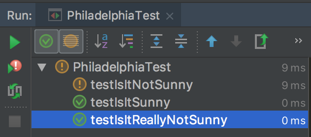
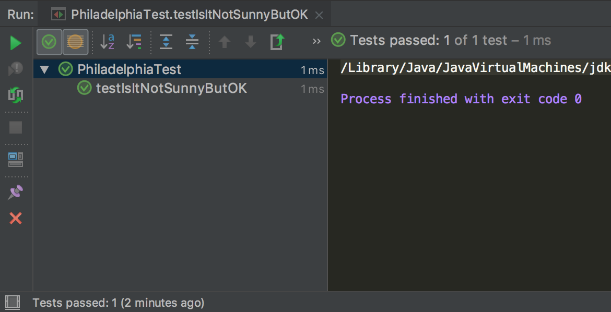
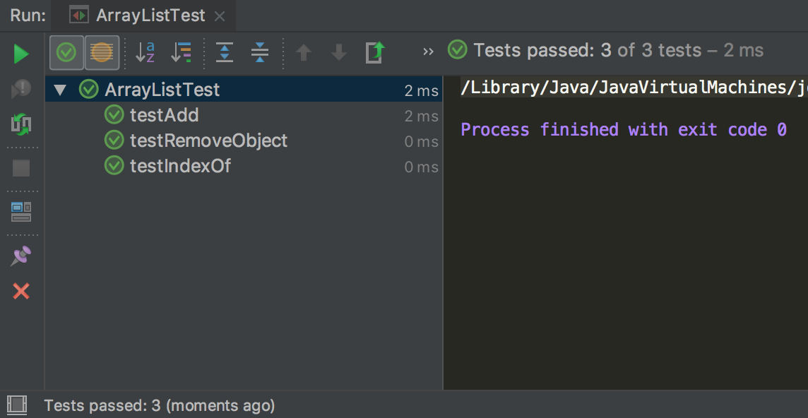
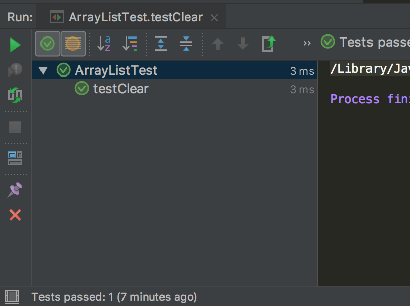
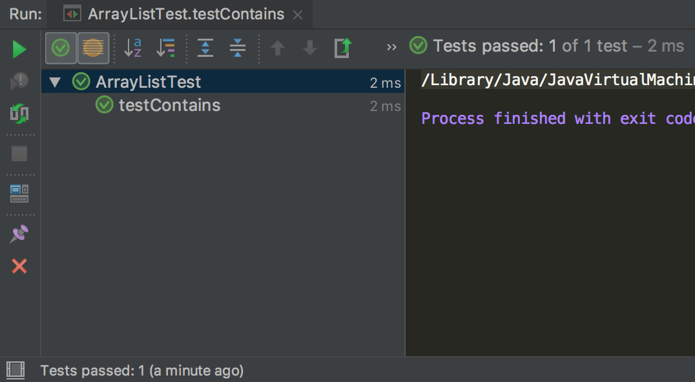
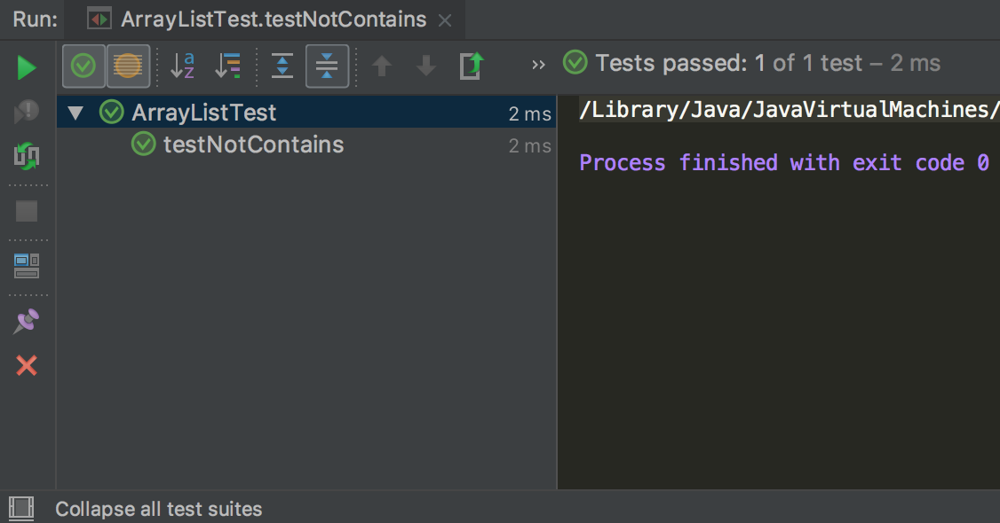
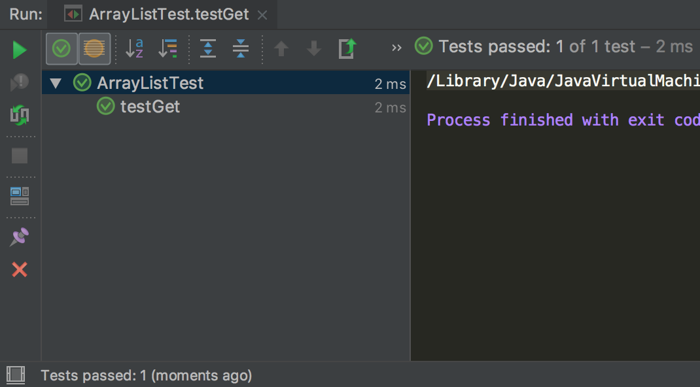
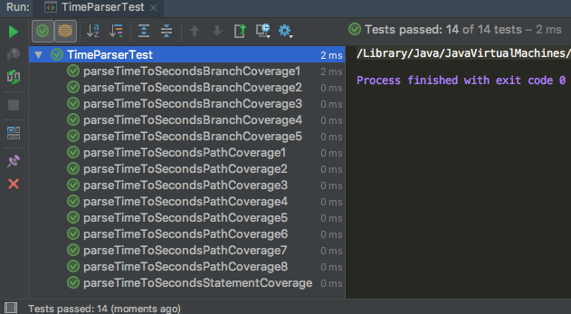
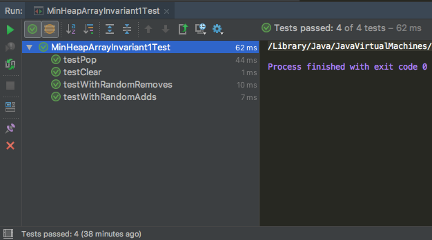

### Software Engineering Lab#5

#### 11510225 Yuxing Hu

# jUnit Testing

---

## Exercise 1

 - Task 1: verify the output
   
   

 - Task 2: an assertion fails
 
   

    I change the phrase from 'assertTrue' to 'assertFalse', but the default code is set to be true, so the test method fails.


 - Task 3: one other static assertion


    ```java
    @Test
    public void testIsItReallyNotSunny() {
        assertFalse(!Philadelphia.isItSunny());
    }
    ```
    
    I used the assertFalse method but this time I changed the inside function to be ture so the result stays true.

    


 - Task 4: a new test that throws an exception when it is triggered
    
    ```java
    @Test(expected = AssertionError.class)
    public void testIsItNotSunnyButOK() {
        assertFalse(Philadelphia.isItSunny());
    }
    ```
    
    I added the expecteed into the test method so it will pass if the method throws an expection.

    

## Exercise 2

 - Task 1: the same output
    
    

 - Task 2: tests the "clear" method
 
    ```java
    @Test
    public void testClear(){
        testArray.clear();
        assertEquals(0,testArray.size());
    }
    ```

    

 - Task 3: tests the "contains"
    
    ```java
    @Test
    public void testContains() {
        assertEquals(true,testArray.contains(3));
    }
    ```

    

 - Task 4: tests the "contains" 
    
    ```java
    @Test
    public void testNotContains() {
        assertEquals(false,testArray.contains(6));
    }
    ```

    

 - Task 5: tests the "get"

    ```java
    @Test
    public void testGet() {
        assertEquals((Integer) 3,testArray.get(0));
    }
    ```

    

## Exercise 3
 
 - Task 1: statement coverage
 
    ```java
    @Test
    public void parseTimeToSecondsStatementCoverage() {
        assertEquals(48225, TimeParser.parseTimeToSeconds("1:23:45 pm"));
    }
    ```

 - Task 2: branch coverage
    
    ```java
    @Test()
    public void parseTimeToSecondsBranchCoverage1() {
        try{
            int x = TimeParser.parseTimeToSeconds("1 23 45 pm");
        }catch(Exception e){
            // e.getClass().getCanonicalName()
            assertEquals("Unrecognized time format",e.getMessage());
        }
    }

    @Test()
    public void parseTimeToSecondsBranchCoverage2() {
        try{
            int x = TimeParser.parseTimeToSeconds("1 23:45 pm");
        }catch(Exception e){
            assertEquals("Unrecognized time format",e.getMessage());
        }
    }

    @Test()
    public void parseTimeToSecondsBranchCoverage3() {
        assertEquals(5025, TimeParser.parseTimeToSeconds("1:23:45 am"));
    }

    @Test()
    public void parseTimeToSecondsBranchCoverage4() {
        assertEquals(5025, TimeParser.parseTimeToSeconds("1:23:45"));
    }

    @Test()
    public void parseTimeToSecondsBranchCoverage5() {
        try{
            int x = TimeParser.parseTimeToSeconds("99:23:45 pm");
        }catch(Exception e){
            assertEquals("Unacceptable time specified",e.getMessage());
        }
    }
    ```

 - Task 3: path coverage
    
    ```java
    @Test()
    public void parseTimeToSecondsPathCoverage1() {
        try{
            int x = TimeParser.parseTimeToSeconds("1 23 45 pm");
        }catch(Exception e){
            // e.getClass().getCanonicalName()
            assertEquals("Unrecognized time format",e.getMessage());
        }
    }

    @Test()
    public void parseTimeToSecondsPathCoverage2() {
        try{
            int x = TimeParser.parseTimeToSeconds("1 23:45 pm");
        }catch(Exception e){
            assertEquals("Unrecognized time format",e.getMessage());
        }
    }

    @Test()
    public void parseTimeToSecondsPathCoverage3() {
        assertEquals(5025, TimeParser.parseTimeToSeconds("1:23:45 am"));
    }

    @Test()
    public void parseTimeToSecondsPathCoverage4() {
        assertEquals(48225, TimeParser.parseTimeToSeconds("1:23:45 pm"));
    }

    @Test()
    public void parseTimeToSecondsPathCoverage5() {
        assertEquals(5025, TimeParser.parseTimeToSeconds("1:23:45"));
    }

    @Test()
    public void parseTimeToSecondsPathCoverage6() {
        try{
            int x = TimeParser.parseTimeToSeconds("99:23:45 am");
        }catch(Exception e){
            assertEquals("Unacceptable time specified",e.getMessage());
        }
    }

    @Test()
    public void parseTimeToSecondsPathCoverage7() {
        try{
            int x = TimeParser.parseTimeToSeconds("99:23:45 pm");
        }catch(Exception e){
            assertEquals("Unacceptable time specified",e.getMessage());
        }
    }

    @Test()
    public void parseTimeToSecondsPathCoverage8() {
        try{
            int x = TimeParser.parseTimeToSeconds("99:23:45");
        }catch(Exception e){
            assertEquals("Unacceptable time specified",e.getMessage());
        }
    }
    ```

    Overall result:

    

## Exercise 4

 - Task: executing your test, find problem

    ```java
    private boolean invariantNew() {
        for (int i = 0; i < heap.size() / 2; i++) {
            if (heap.get(i) > heap.get(i * 2 + 1)) {
                return false;
            }
            if (i * 2 + 2 < heap.size()) {
                if (heap.get(i) > heap.get(i * 2 + 2))
                    return false;
            }
        }
        return true;
    }
    ```
    
    

 There's actually no problem with the current test.

 
    


