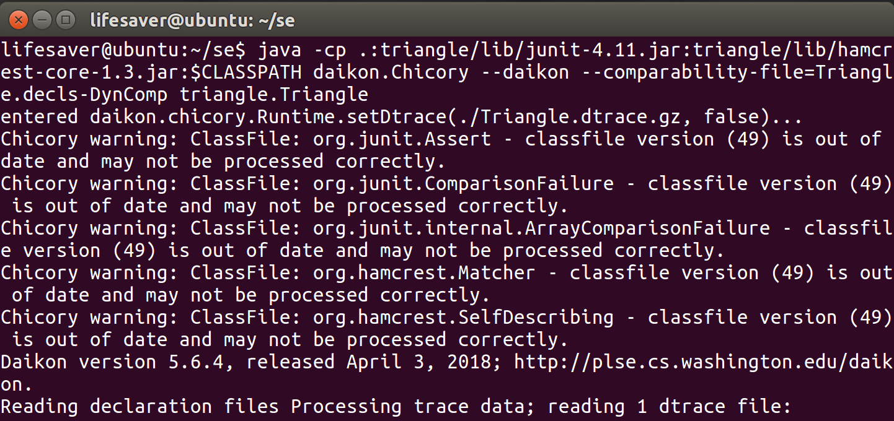
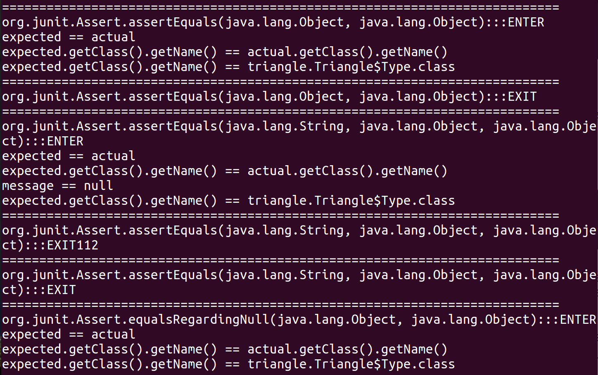
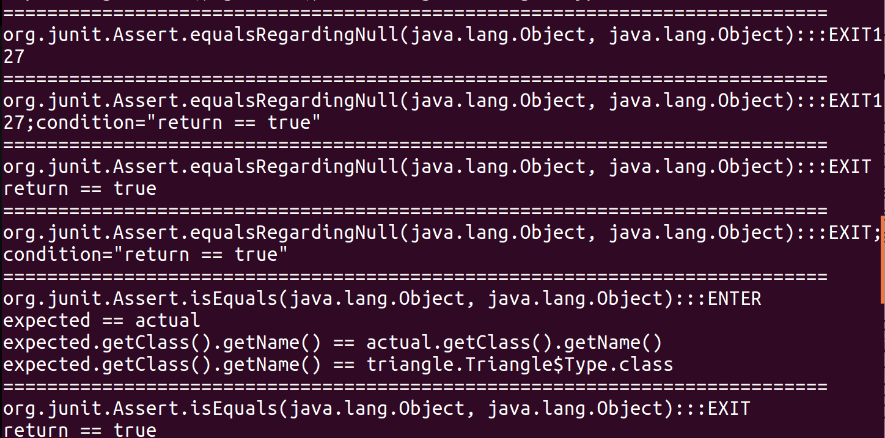
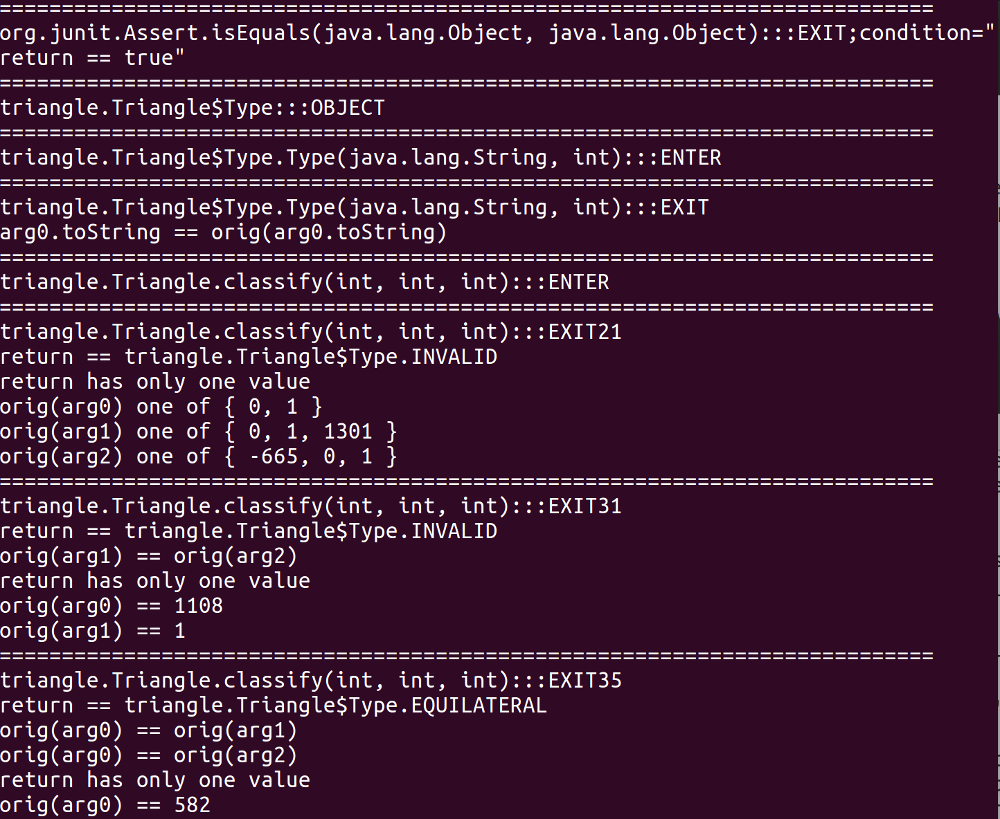
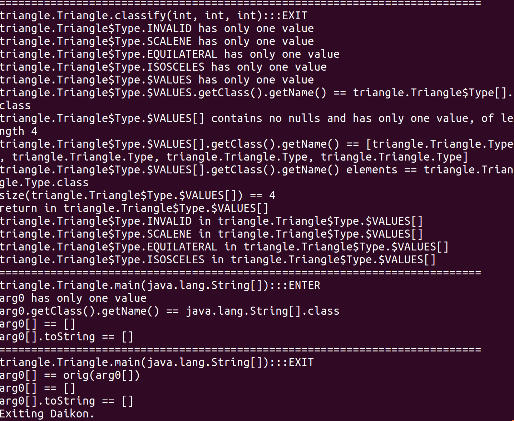

# Software Engineering Lab#8

### 11510225 Yuxing Hu

---

## All shell command I've used

* export DAIKONDIR=se/daikon-5.6.4
    - Set the path of daikon
* export JAVA_HOME=/usr/lib/java_1.8.0_130
    - Set the path of java virtual machine
* source $DAIKONDIR/scripts/daikon.bashrc
    - Add the configuration files into the system
* sudo apt-get install openjdk-8-jdk gcc ctags graphviz netpbm texlive texinfo
    - Add the dependencies of Daikon
* sudo apt-get install m4 automake autoconf binutils-dev
    - Add the dependencies of Kvasir
* make -C $DAIKONDIR rebuild-everything
    - Compile Daikon and build other things
* cd triangle 
    - Go to triangle folder
* javac -cp .:lib/junit-4.11.jar:hamcrest-core-1.3.jar Triangle.java
    - Compile the triangle file
* cd ..
    - Back to upper layer
* java -cp .:triangle/lib/junit-4.11.jar:triangle/lib/hamcrest-core-1.3.jar:$CLASSPATH daikon.DynComp triangle.Triangle
    - Detecting invariants part 1
*  java -cp .:triangle/lib/junit-4.11.jar:triangle/lib/hamcrest-core-1.3.jar:$CLASSPATH daikon.Chicory --daikon --comparability-file=Triangle.decls-DynComp triangle.Triangle
    - Detecting invariants part 2

## Triangle running results

## Result analysis

1. The daikon program has several output files including Triangle.decls-DynComp, Triangle.dtrace.gz, Triangle.inv.gz.
2. From top to bottom, the first few lines is the warning message of chicory which do not require our attention.
3. ::ENTER is the point at the entry to procedure, and the invariants at that point are the preconditions for the program method, properties that are always true when the procedure is invoked.
4. :::EXIT is the program point at the procedure exit, and invariants there are postconditions. When there are multiple exit points from a procedure (for instance, because of multiple return statements), the different exits are differentiated by suffixing them with their line numbers. 
5. :::EXIT112. The exit point lacking a line number (in this example, Triangle.main():::EXIT) collects the postconditions that are true at every numbered exit point. This is an example of a program point that represents a collection of locations in the program source rather than a single location. 
6. :::EXIT; condition="" is the program exiting point with the condition situation which indicate the reason of exiting.
7. The :::OBJECT tag indicates object invariants over all the instance fields and static fields of the class. These properties always hold for any object of the given class, from the point of view of a client or user. These properties hold at entry to and exit from every public method of the class.
8. orig(x) refers to the value of variable x upon entry to a procedure. These variables appear only at :::EXIT program points. Typically, orig() variables do not appear in the trace, but are automatically created by Daikon when it matches up :::ENTER and :::EXITnn program points. 